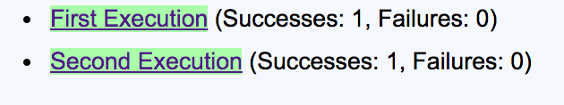

[](https://travis-ci.org/concordion/concordion-run-totals-extension)
[](http://search.maven.org/#search%7Cga%7C1%7Cg%3A%22org.concordion%22%20AND%20a%3A%22concordion-run-totals-extension%22)
[](http://www.apache.org/licenses/LICENSE-2.0.html)

This [Concordion](http://www.concordion.org) extension adds run totals to the Concordion output whenever the [concordion:run](http://concordion.org/Tutorial.html#concordion:run) command is used.

# Introduction

This extension allows us to reveal run totals in the Concordion output, without obscuring the intent of the specification. For example:



# Installation
The extension is available from [Maven Central](http://search.maven.org/#artifactdetails%7Corg.concordion%7Cconcordion-run-totals-extension%7C1.0.0%7Cjar).

### Dependencies
This extension requires Concordion v1.5.0 or later.

Note that Concordion 2.1.0 has breaking changes, that require this extension to be updated to version 1.1.0 or later.

# Configuration

## Default Configuration

To install the extension, either annotate the fixture class with:

```java
    @Extensions(RunTotalsExtension.class)
```

or set the system property `concordion.extensions` to `org.concordion.ext.runtotals.RunTotalsExtension`.
